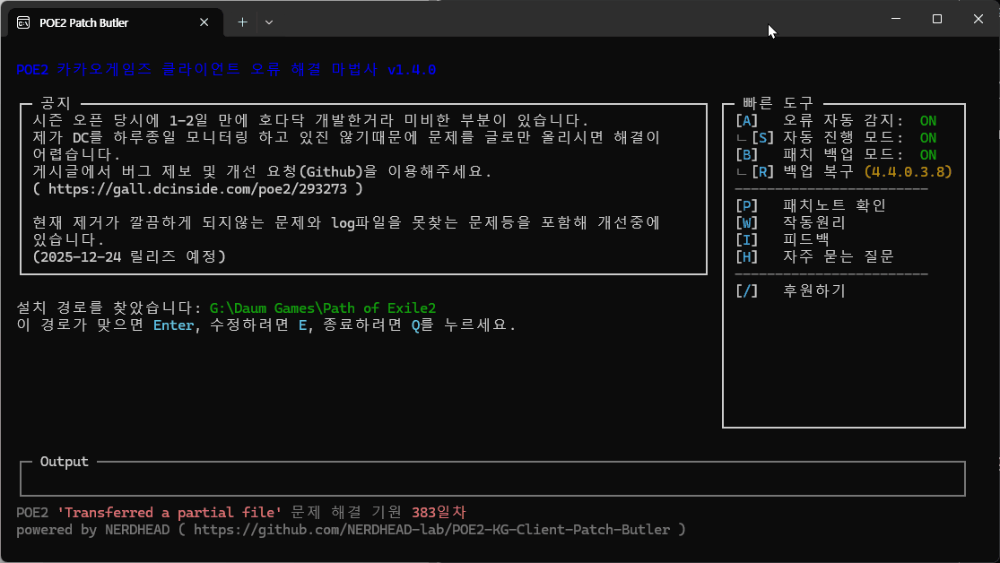

<!-- prettier-ignore-start -->

| GitHub Release                                                 | Build Status                                             | License                                                        | Sponsors                                                          | Buy Me a Coffee                                                   |
|----------------------------------------------------------------|----------------------------------------------------------|----------------------------------------------------------------|-------------------------------------------------------------------|-------------------------------------------------------------------|
| [![GitHub release][github-release-badge]][github-release-link] | [![Build Status][build-status-badge]][build-status-link] | [![GitHub license][github-license-badge]][github-license-link] | [![GitHub sponsors][github-sponsors-badge]][github-sponsors-link] | [![Buy Me a Coffee][buy-me-a-coffee-badge]][buy-me-a-coffee-link] |

<!-- prettier-ignore-end -->

<!-- Badges -->

[github-release-badge]: https://img.shields.io/github/v/release/NERDHEAD-lab/POE2-KG-Client-Patch-Butler?logo=github
[build-status-badge]: https://github.com/NERDHEAD-lab/POE2-KG-Client-Patch-Butler/actions/workflows/release-please.yml/badge.svg
[github-license-badge]: https://img.shields.io/github/license/NERDHEAD-lab/POE2-KG-Client-Patch-Butler
[github-sponsors-badge]: https://img.shields.io/github/sponsors/NERDHEAD-lab?logo=github&logoColor=white
[buy-me-a-coffee-badge]: https://img.shields.io/badge/Buy%20Me%20a%20Coffee-yellow?logo=buymeacoffee&logoColor=white

<!-- Links -->

[github-release-link]: https://github.com/NERDHEAD-lab/POE2-KG-Client-Patch-Butler/releases
[build-status-link]: https://github.com/NERDHEAD-lab/POE2-KG-Client-Patch-Butler/actions
[github-license-link]: https://github.com/NERDHEAD-lab/POE2-KG-Client-Patch-Butler/blob/master/LICENSE
[github-sponsors-link]: https://github.com/sponsors/NERDHEAD-lab
[buy-me-a-coffee-link]: https://coff.ee/nerdhead_lab


# POE2 KG Client Patch Butler



Kakao Games에서 퍼블리싱하는 Path of Exile 2 한국 클라이언트의 패치 및 실행 오류를 자동으로 감지하여 해결해주는 도구입니다.
패치 실패뿐만 아니라 다양한 클라이언트 종료 및 실행 문제에 대한 해결 가이드를 제공합니다.

## 주요 기능

- 클라이언트에서 업데이트 실패 시 원인 분석 및 자동화 도구 제공
- 클라이언트에서 업데이트 실패 시 자동 감지 및 오류 수정 제안 (도구 실행 후 A를 눌러 활성화)
- 클라이언트 실행 간 종료되거나 실행되지 않는 문제에 대한 대응 가이드 제공 (일부 자동화)
- 기타 이슈에 대한 문서 제공

## 사용 방법

### 📥 다운로드

[Releases](https://github.com/NERDHEAD-lab/POE2-KG-Client-Patch-Butler/releases) 페이지에서 버전에 맞는 파일을 다운로드합니다.

| 버전 | 파일명 | 설명 |
|---|---|---|
| **설치 버전 (권장)** | `poe2-patch-butler-setup.exe` | 프로그램 추가/제거에 등록되어 관리가 용이하며, 설정이 유지됩니다. |
| **포터블 버전** | `poe2-patch-butler.exe` | 설치 없이 바로 실행 가능하나, 파일 이동 시 설정이 초기화될 수 있습니다. |

### 🚀 실행 가이드

1. 프로그램 실행:
   - 설치 버전은 설치 후 실행, 포터블 버전은 다운로드한 파일을 직접 실행합니다.
2. 자동 경로 탐지 및 분석 (`Enter`로 진행):
   - 설치 경로를 자동으로 찾습니다. 맞으면 `Enter`.
   - 로그를 분석하여 복구할 파일을 찾습니다. 맞으면 `Enter`.
3. 다운로드 및 복구:
   - 자동으로 다운로드가 진행됩니다.
4. 완료 및 정리:
   - 작업 완료 후 임시 폴더를 삭제(`Enter`)하거나 보존(`Q`)할 수 있습니다. (성공 시 `Enter` 권장)
   - 프로그램 종료 후 **공식 홈페이지**에서 게임을 다시 시작하세요.

## 지원 및 문의

- [자주 묻는 질문 (FAQ)](https://nerdhead-lab.github.io/POE2-KG-Client-Patch-Butler?docs=FAQ.md)
- [버그 제보 및 개선 요청 (Github)](https://github.com/NERDHEAD-lab/POE2-KG-Client-Patch-Butler/issues)
- [동작 원리](https://nerdhead-lab.github.io/POE2-KG-Client-Patch-Butler?docs=PRINCIPLES.md)
- [오픈 카카오톡](https://open.kakao.com/o/sK3FU2Fh)

## 개발

### 요구 사항

- Node.js 22+
- npm

### 설치 및 실행

```bash
# 의존성 설치
npm install

# 개발 모드 실행
npm run dev

# 빌드
npm run build

# 실행 파일 생성
npm run package
```

## 라이선스

[MIT](LICENSE)
