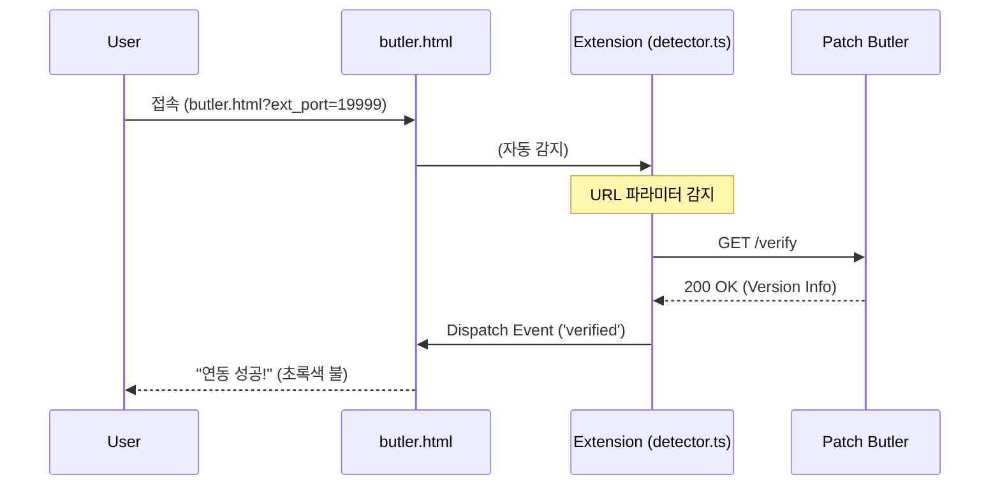
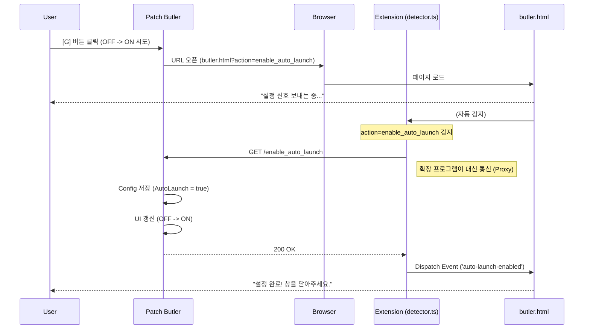
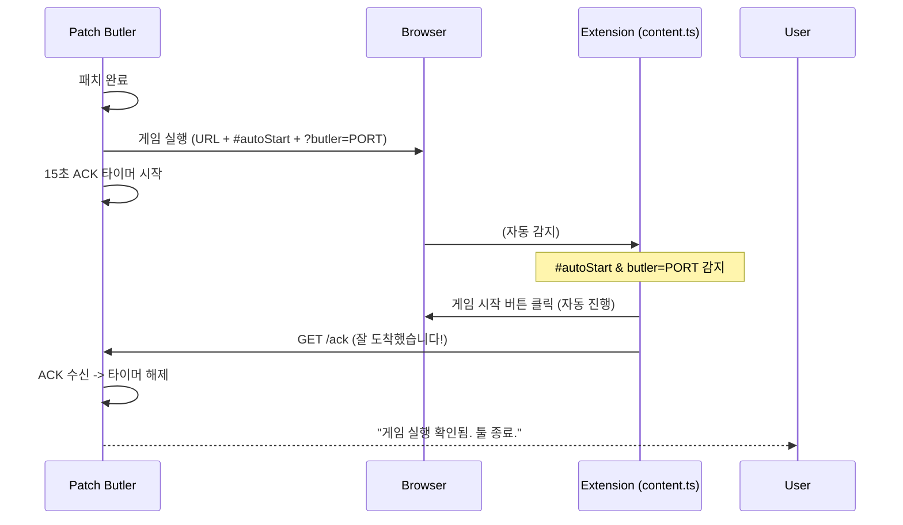

# 아키텍처 및 통신 워크플로우 (Architecture & Communication Flow)

Patch Butler(툴), Quick Launch(확장 프로그램), 그리고 Web Page(butler.html) 간의 역할 분담과 상호작용(Tiki-Taka)을 정의합니다.

## 1. 컴포넌트 역할 정의 (Role Definition)

| 컴포넌트         | 구분         | 핵심 역할                 | 권한 및 특징                                                                                                                        |
| :--------------- | :----------- | :------------------------ | :---------------------------------------------------------------------------------------------------------------------------------- |
| **Patch Butler** | `Local Tool` | **서버 & 설정 관리**      | - 로컬 HTTP 서버 구동 (`127.0.0.1:PORT`) - 게임 실행 및 설정 파일(`config.js`) 제어                                              |
| **Quick Launch** | `Chrome Ext` | **통신 중계 & 게임 조작** | - `server.ts`(툴)와 직접 통신 가능 (Mixed Content 제약 없음) - `butler.html` 및 `Daum Game` 페이지 DOM 조작                      |
| **butler.html**  | `Web Page`   | **UI 표시 (Display)**     | - 사용자에게 상태 메시지 표시 - **직접적인 통신 권한 없음** (보안상 로컬 서버 호출 불가) - 오직 확장 프로그램의 이벤트만 수신 |

---

## 2. 통신 시나리오 (Interaction Flows)

### A. 연동 확인 (Verification)

> 사용자가 `butler.html`에 접속하여 툴과 확장 프로그램이 잘 연결되었는지 확인할 때

### B. 게임 자동 시작 설정 켜기 (Enable Auto Launch)

> 사용자가 툴에서 `[G]` 버튼을 눌러 자동 시작을 켜려고 할 때 ("진짜 켜도 돼?" 확인 과정)

### C. 게임 실행 및 ACK (Actual Execution)

> 실제 패치 완료 후 게임을 실행하고, 잘 떴는지 확인할 때

