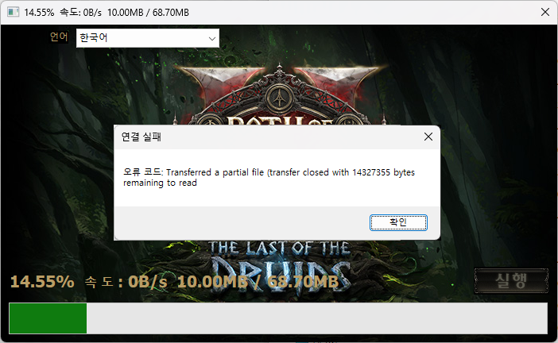
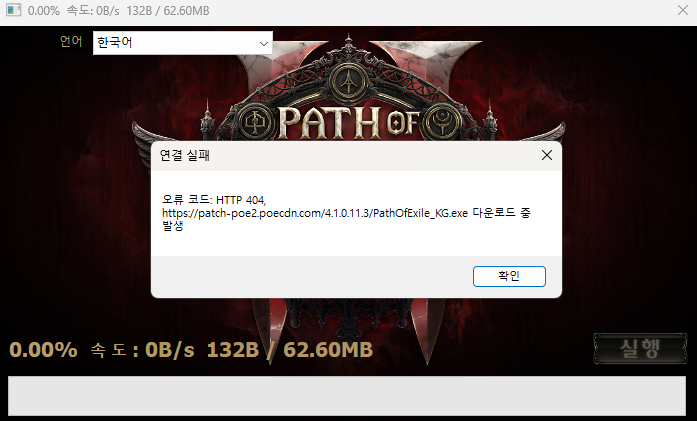

# 작동 원리 (Principles)

POE2 Patch Butler가 어떤 방식으로 오류를 해결하는지에 대한 기술적인 설명입니다.

## 1. 패치 실패 해결 (CASE 1)

카카오게임즈 런처가 패치 파일을 다운로드하는 과정에서
- 진행도가 10.0MB 정도에서 실패하고 재시도 하며 `Transferred a partial file` 오류가 발생합니다.
- 또는 다운로드 자체에 실패하며 `http 404` 오류가 발생합니다.

### 동작 원리
1.  **로그 파일 분석**: `{poe2 설치경로}/logs/KakaoClient.txt` 로그 파일을 읽어 가장 최근 실행된 세션(PID)을 찾습니다.
2.  **CDN 주소 추출**: 로그 내에서 `Web root:` 또는 `Backup Web root:` 로 시작하는 라인을 찾아, 런처가 접속하려던 CDN 주소와 버전 정보를 알아냅니다.
3.  **다운로드 대기열 확인**: `Queue file to download:` 로그를 분석하여 런처가 다운로드하려고 시도했던 파일 목록을 추출합니다.
4.  **직접 다운로드**: 추출한 정보로 이 프로그램이 직접 CDN에 접속하여, 실패했거나 누락된 파일(Whitelist 기반)들을 다운로드하여 덮어씁니다.
5.  **임시 파일 정리**: 프로그램에서 패치 파일을 임시로 받는 `.patch_temp` 폴더를 정리합니다.

---

## 2. 실행 불가 해결 (CASE 2)

"게임 시작" 버튼을 눌러도 반응이 없거나, 로고만 뜨고 꺼지는 경우입니다.
이 경우는 로그에 패치 실패 기록이 없거나, 이미 패치는 완료되었다고 나오는데 실행이 안 되는 상황입니다.

### 동작 원리 (단계별 진행)
1.  **핵심 파일 강제 복구**: `autoDetect`나 `CASE 1`과 달리 로그에서 실패한 파일을 찾지 못했으므로, 미리 정의된 **필수 파일(Whitelist)** 목록(`Client.exe`, `PathOfExile.exe`, `PackCheck.exe` 등 실행 파일류)을 강제로 CDN에서 다시 받아 덮어씁니다.
2.  **셰이더 캐시 초기화**: `%APPDATA%/Path of Exile 2` 내의 `ShaderCacheD3D12`, `ShaderCacheVulkan` 폴더를 삭제하여 그래픽 랜더링 관련 충돌을 방지합니다.
3.  **PackCheck 실행**: POE 클라이언트에 내장된 `PackCheck.exe`를 실행하여 거대 데이터 파일(`Content.ggpk`)의 무결성을 검사합니다.

---

## 3. 자동 감지 모드 (Auto Detect)

사용자가 수동으로 도구를 실행하지 않아도, 게임 실행 문제가 발생하면 자동으로 도구를 띄워줍니다.

### 동작 원리
1.  **프로세스 폴링**: 주기적으로 시스템의 프로세스 목록을 확인하여 `POE2_Launcher.exe`가 실행 중인지 감시합니다.
2.  **짧은 세션 감지**: 런처가 실행된 지 **5분 미만**에 종료되면 비정상 종료로 의심합니다.
3.  **로그 검사 트리거**: 비정상 종료가 감지되면 즉시 `KakaoClient.txt` 로그를 분석(`checkLogForErrors`)합니다.
4.  **에러 판독**: 로그의 최근 세션에서 `[WARN]`, `[ERROR]`, `Error:` 등의 키워드가 발견되면 사용자에게 "업데이트 실패가 감지되었습니다" 경고창을 띄웁니다.
